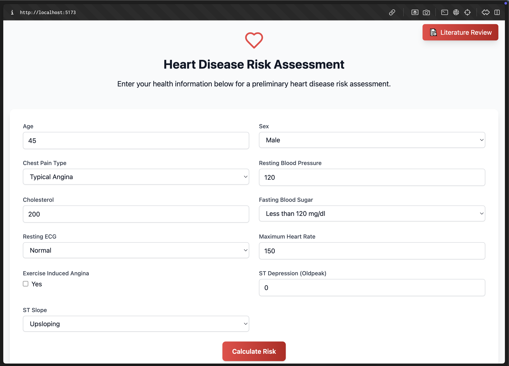
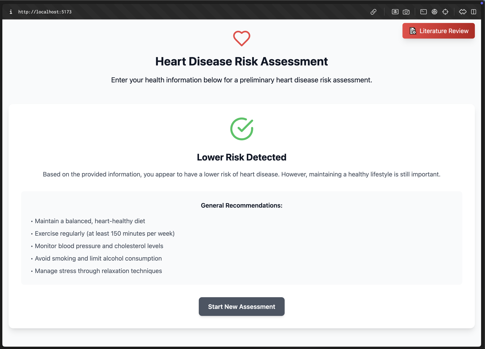
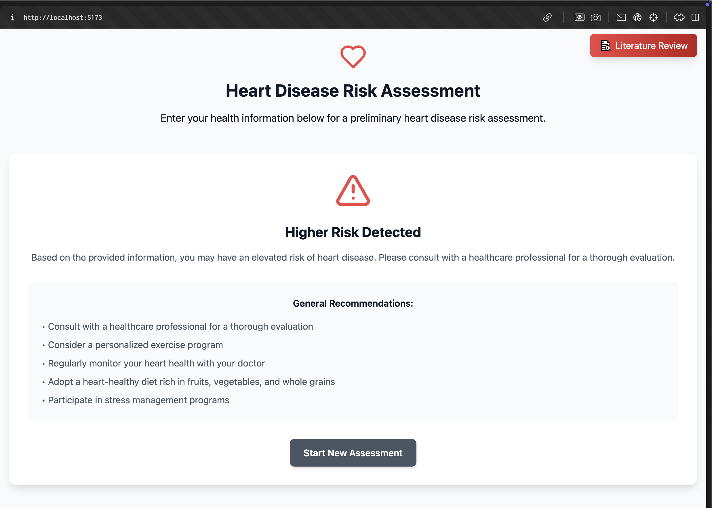

# ❤️ Heart Disease Risk Assessment

  
  
  
  

> A web-based tool to help users assess their heart disease risk using health metrics and AI predictions.

---

## 📝 Description
This application allows users to input their health data and receive a preliminary heart disease risk assessment. Based on the results, users are given personalized health recommendations and access to a curated literature review for further insights.

---

## 📚 Table of Contents
- Features
- Installation
- Usage
- API Documentation
- Configuration
- Testing
- Deployment
- Contributing
- License
- Acknowledgments
- Screenshots/Demos
- Changelog
- FAQ

---

## ✨ Features
- User-friendly UI for health data entry.
- AI-powered predictions using logistic regression models.
- Personalized recommendations tailored to risk categories.
- Insights hub with resources and research studies.
- Fully responsive design for mobile and desktop users.

---

## 🛠️ Installation
Follow these steps to set up the project locally:

1. Clone the repository:
   ```bash
   git clone https://github.com/MynkSinghal/healthcare-aiLab.git
   cd healthcare-aiLab
   ```

2. Install dependencies:
   ```bash
   npm install
   ```

3. Start the development server:
   ```bash
   npm run dev
   ```

---

## 🎮 Usage
1. Open your browser and navigate to `http://localhost:3000`.
2. Fill out the form with your health data.
3. Click "Calculate Risk" to receive an assessment.
4. Explore tailored recommendations and related literature.

---

## 📡 API Documentation
The app uses health metrics to calculate risk:
- Age: Integer  
- Sex: Male/Female  
- Chest Pain Type: Categories (0-3)  
- Resting Blood Pressure: mmHg  
- Cholesterol Level: mg/dL  
- Fasting Blood Sugar: Yes/No  
- Resting ECG: Categories (0-2)  
- Maximum Heart Rate: bpm  
- Exercise-Induced Angina: Yes/No  
- ST Depression (Oldpeak): Float  
- ST Slope: Categories (0-2)

Prediction is based on a logistic regression model trained on publicly available datasets.

---

## ⚙️ Configuration

- Ensure dependencies are up to date with:
   ```bash
   npm install
   ```

---

## ✅ Testing
Run ESLint to ensure code quality:
   ```bash
   npm run lint
   ```

For end-to-end testing:
   ```bash
   npm run test
   ```

---

## 🚀 Deployment
1. Build the project for production:
   ```bash
   npm run build
   ```
2. Serve the `dist` folder using a static server:
   ```bash
   npm install -g serve
   serve -s dist
   ```

---

## 📜 License
This project is licensed under the **MIT License**. See the LICENSE file for details.

---

## 🙏 Acknowledgments
Special thanks to:
- Dr. A. Kumar & Dr. L. Chen for their groundbreaking ML research.  
- Dr. Maria Lopez & Dr. Samir Patel for their contributions to AI in healthcare.  
- The open-source community for invaluable libraries and tools.

---

## 📷 Screenshots/Demos
**Page 1**  


**Page 2**  


**Page 3**  


---

## 💬 FAQ

**Q: What data is required for the assessment?**  
You’ll need to provide health-related metrics like age, blood pressure, cholesterol, etc.  

**Q: Is the assessment medically accurate?**  
It’s a statistical model-based prediction and not a substitute for professional medical advice.  

---

## 📬 Contact Information
Have questions or suggestions? Reach out!  
- Name: Mayank Singhal  
- Email: [singhal2004mayank@gmail.com](mailto:singhal2004mayank@gmail.com)  
- GitHub: [My GitHub](https://github.com/MynkSinghal)

---

### 🚧 Future Improvements
- Adding more sophisticated ML models like XGBoost or Random Forest.
- Enabling multi-language support for broader accessibility.


